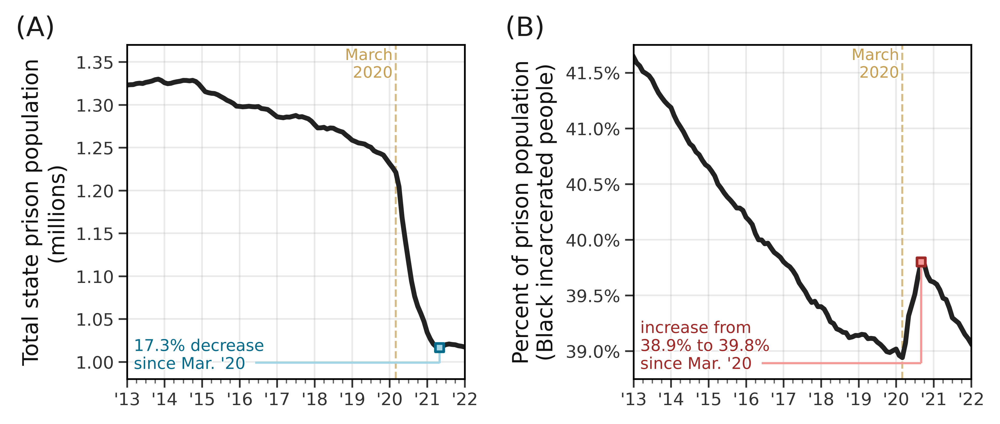
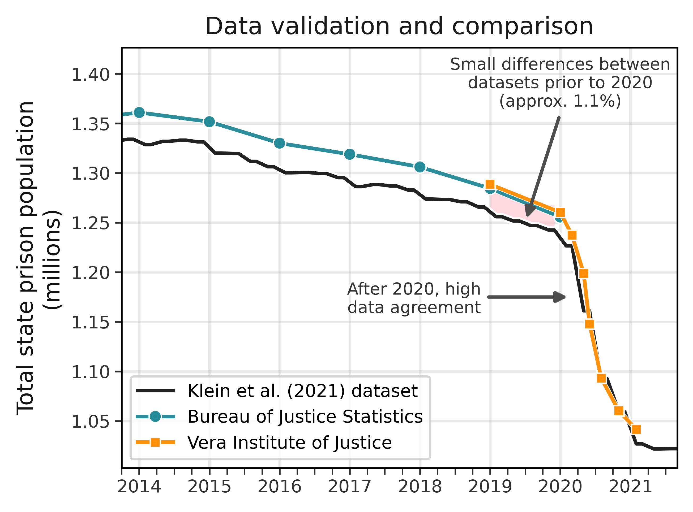

# Dataset on Incarcerated Populations (2023)
The United States has the highest incarceration rate in the world. Through combinations of structural biases in the criminal justice and police systems, we see even higher incarceration rates among Black and Hispanic people. During the first year of the COVID-19 pandemic, the number of incarcerated people in the United States decreased by at least 17%---the largest, fastest reduction in prison population in American history. Using an original dataset curated from public sources on prison demographics across all 50 states and the District of Columbia, we show that incarcerated white people benefited disproportionately from this decrease in the U.S. prison population, and the fraction of incarcerated Black and Latino people sharply increased. This pattern persists across prison systems in nearly every state and deviates from a decade-long trend before 2020 and the onset of COVID-19, when the proportion of incarcerated white people was increasing amid declining numbers of Black people in prison. While a variety of mechanisms underlie these alarming trends, we explore why racial inequities in average sentence length are a likely major contributor. Ultimately, this study reveals how disruptions caused by COVID-19 exacerbated racial inequalities in the criminal legal system, and highlights key forces that drive mass incarceration.

See the full writeup and analyses here: https://www.medrxiv.org/content/10.1101/2021.12.14.21267199v2. Forthcoming, *Nature*.

This work is a collaboration between researchers at the **Institute on Policing, Incarceration, and Public Safety** at Harvard University, Yale University, the Santa Fe Institute, MIT, and Northeastern University.

## Data and findings

State-by-state data is included in the data/ folder.

<p align="center">

</p>

------


## Notebooks
1. [Example data collection with Tabula - Georgia](https://github.com/jkbren/incarcerated-populations/blob/main/code/georgia.ipynb)
2. [Create figures for paper](https://github.com/jkbren/incarcerated-populations/blob/main/code/figures.ipynb)


## Other datasets
1. data/flcourts.csv - [Florida Trial Court Statistics (January 2017 - June 2020)](http://trialstats.flcourts.org/)
2. data/BJS_data.csv - [Bureau of Justice Statistics (Prisoners in 2019)](https://bjs.ojp.gov/library/publications/prisoners-2019)


## Limitations
As is always the case when collecting publicly-available data, there is the possibility of human error, both on the side of the individuals collecting the data and on the side of the individuals posting the data. Additionally, data for some of the states in this dataset are different from data released by the Bureau of Justice Statistics. We make note of these in accompanying manuscript, and justify our numbers either by linking to the exact data source or because the data we use comes directly from the state's Department of Corrections via a public records request.

<p align="center">

</p>


### Main packages used  <a name="requirements"/>

This code is written in [Python 3.x](https://www.python.org) and uses the following packages:

* [Pandas](https://pandas.pydata.org/) 1.1.3
* [tabula](https://tabula-py.readthedocs.io/en/latest/) 2.2.0
* [Numpy](http://numpy.scipy.org/) 1.19.2
* [beautifulsoup4](https://www.crummy.com/software/BeautifulSoup/) 4.9.3
* [requests](https://docs.python-requests.org/en/latest/) 2.24.0


## Citation
If you use this data or would like to cite this work:

Bibtex: 
```text
@article{Klein2023decarceration,
    title = {{COVID-19 amplified racial disparities in the U.S. criminal legal system}},
    author = {Klein, Brennan and Ogbunugafor, C. Brandon and Schafer, Benjamin and Bhadricha, Zarana and Kori, Preeti and Sheldon, Jim and Kaza, Nitish and Sharma, Arush and Wang, Emily A. and Eliassi-Rad, Tina and Scarpino, Samuel V. and Hinton, Elizabeth},
    journal = {Nature},
    year = {2023},
    doi = {10.1101/2021.12.14.21267199v2}
}
```

## See also:

* [Vera Institute for Justice](https://www.vera.org/publications/a-technical-guide-to-jail-data-analysis)
* [Bureau of Justice Statistics - Prisoners in 2019](https://bjs.ojp.gov/library/publications/prisoners-2019)
* [Bureau of Justice Statistics - Prisoners in 2020](https://bjs.ojp.gov/library/publications/prisoners-2020-statistical-tables)
* [Bureau of Justice Statistics - Prisoners in 2021](https://bjs.ojp.gov/library/publications/prisoners-2021-statistical-tables)
* [Institute on Policing, Incarceration, and Public Safety](https://www.vera.org/publications/a-technical-guide-to-jail-data-analysis)


## Data Collection Team 

- [Brennan Klein](https://github.com/jkbren)
- Benjamin Schafer
- [Zarana Bhadricha](https://github.com/LittleSodium)
- Preeti Kori
- Jim Sheldon
- Nitish Kaza
- Arush Sharma
- [Samuel Scarpino](https://github.com/scarpino)
- [C. Brandon Ogbunu](https://github.com/OgPlexus)
- Elizabeth Hinton
